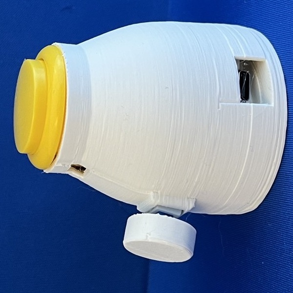
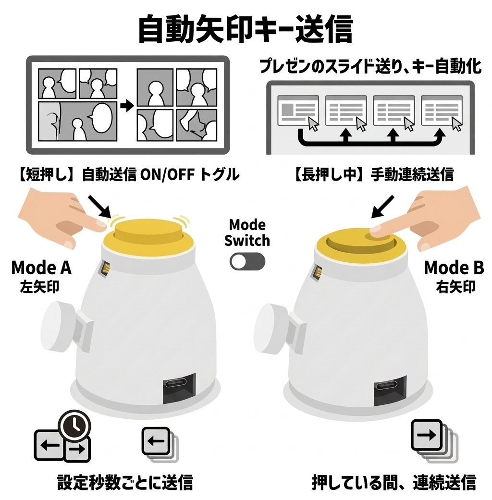
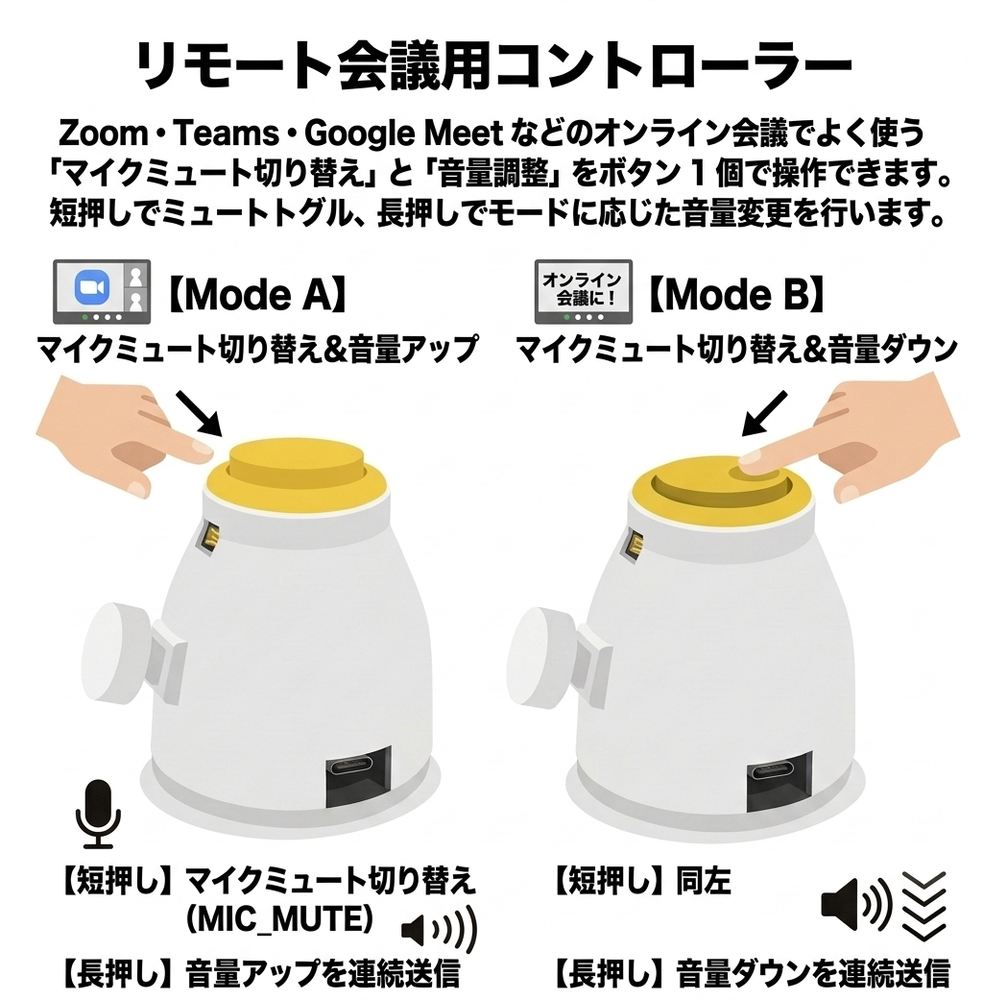
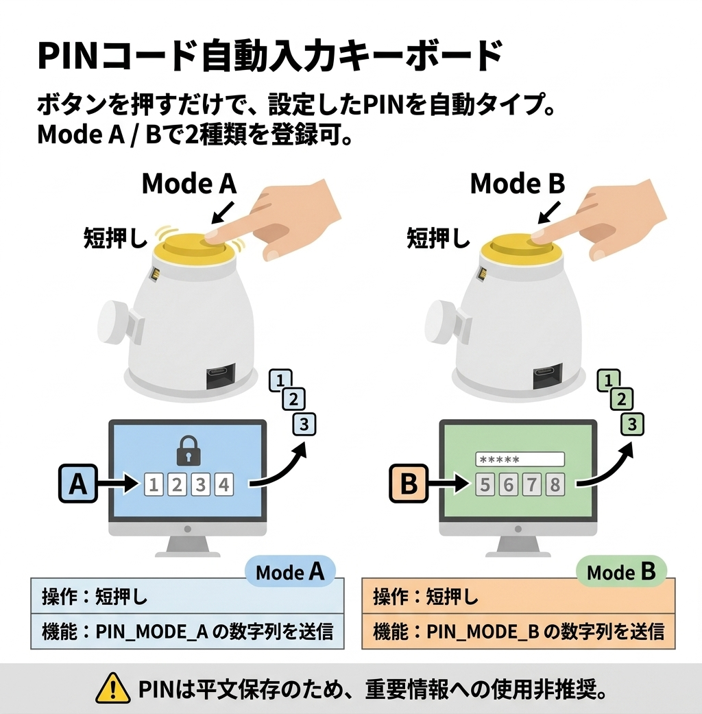
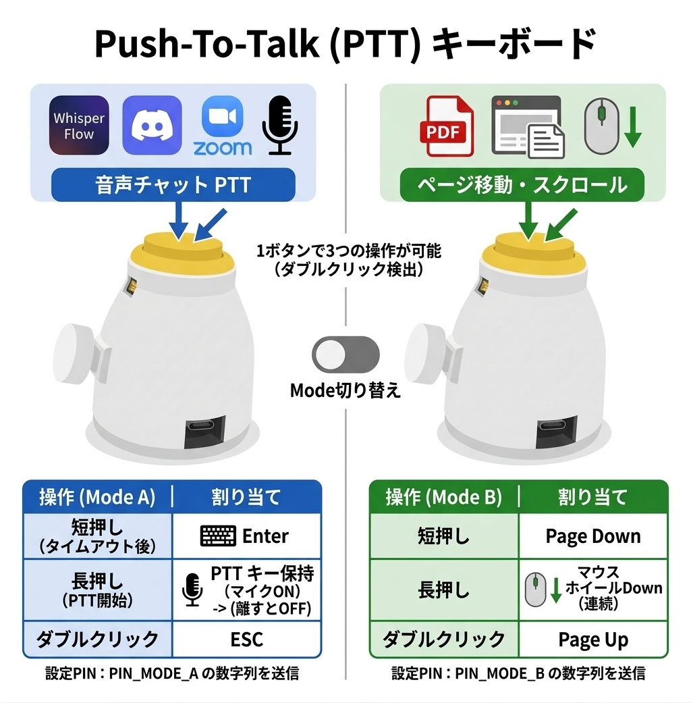
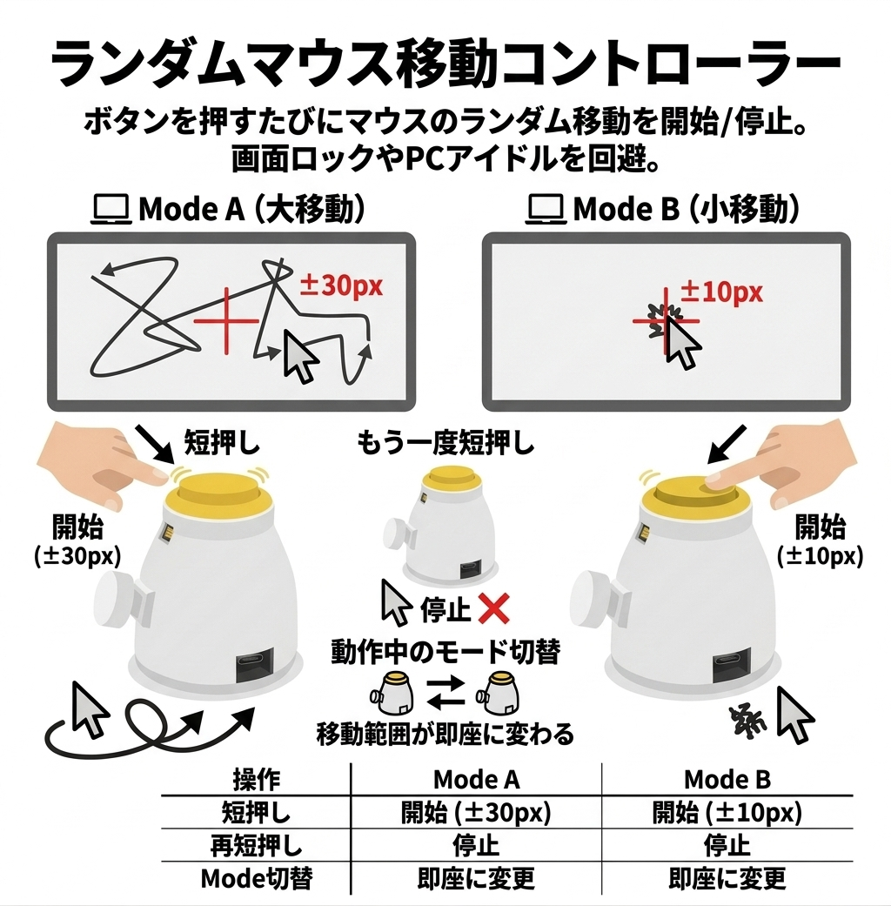
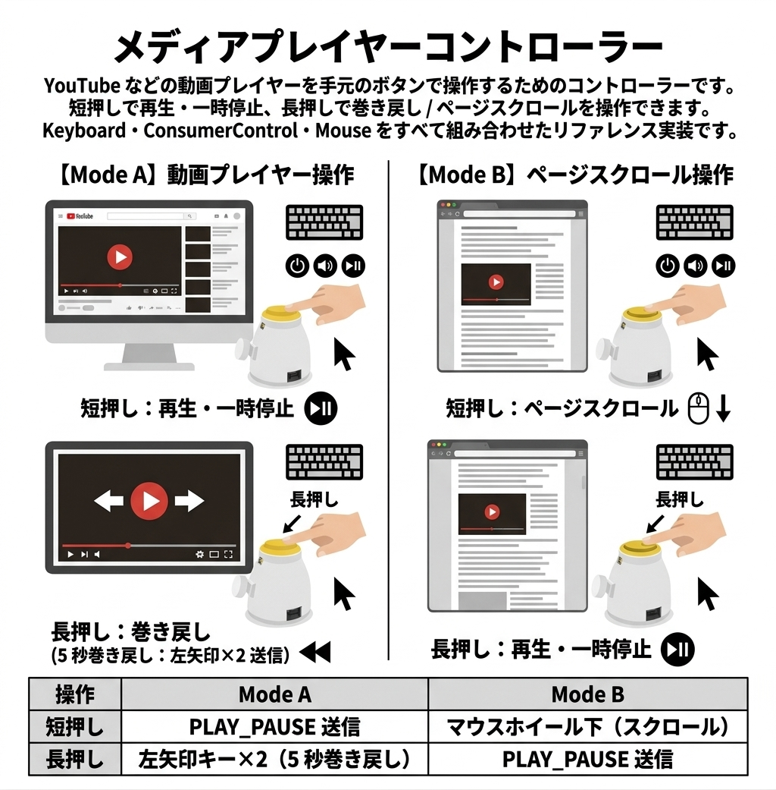
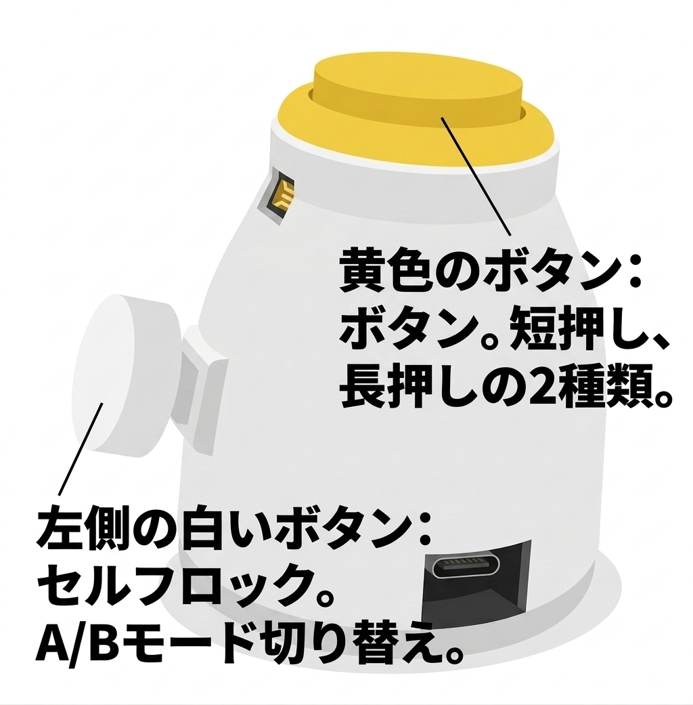

# cuskey



**cuskey** は、RP2040 搭載ボードで動作する CircuitPython 製の USB HID キーコントローラーです。  
ボタン 1 個＋モードスイッチ 1 個という最小構成で、再生制御・PTT・PIN 入力など様々な用途に使えるカスタムキーデバイスを実現します。

📖 詳細ドキュメント: https://cuskey.poppo-ya.com/

---

## 特徴

- **シンプルなハードウェア構成**: ボタン 1 個 + モードスイッチ 1 個
- **モード切替対応**: スイッチ状態により動作を切り替え（Mode A / Mode B）
- **短押し・長押し・ダブルクリック**: 1 ボタンで複数のアクションを割り当て可能
- **USB HID 対応**: Keyboard・ConsumerControl・Mouse すべてに対応
- **設定ファイルで基板切替**: `cuskey_settings.py` を書き換えるだけでピン配置を変更
- **豊富な実装例**: `examples/` に用途別サンプルを収録

---

## ファイル構成

```
cuskey/
├── cuskey_settings.py   # ボード設定（ピン定義・デバッグ設定）
├── code.py              # 実行スクリプト（examples/ からコピーして使用）
└── examples/            # 用途別サンプルスクリプト集
    ├── README.md        # サンプル一覧と動作説明
    ├── auto_keysend.py       # 自動矢印キー送信
    ├── meeting_controller.py # 会議用マイクミュート・音量操作
    ├── pin_sender.py         # PIN コード自動入力
    ├── ptt_key.py            # Push-To-Talk キー
    ├── random_mouse.py       # ランダムマウス移動（スクリーンセーバー防止）
    └── youtube_controller.py # 動画プレイヤー操作
```

---

## 対応ボード

`cuskey_settings.py` の `BOARD_TYPE` で使用するピン配置を切り替えます。

| BOARD_TYPE | ボタン GND | ボタン入力 | モード GND | モード A |
|------------|-----------|-----------|-----------|---------|
| `PinPat4`  | D5        | D6        | D7        | D8      |

新しいボードを追加する場合は、`BOARD_CONFIGS` 辞書に設定を追記します（後述）。

---

## セットアップ

### 1. CircuitPython のインストール

[CircuitPython ダウンロードページ](https://circuitpython.org/board/sparkfun_pro_micro_rp2040/) からボードに対応した `.uf2` ファイルをダウンロードし、ボードに書き込みます。  
（`uf2/` フォルダに Sparkfun Pro Micro RP2040 用のファームウェアを同梱しています）

### 2. HID ライブラリのコピー

Github https://github.com/adafruit/Adafruit_CircuitPython_HID からソースコードをdownload(or git clone) します。

ダウンロードした `Adafruit_CircuitPython_HID/adafruit_hid/` フォルダを CIRCUITPY の `lib/` にコピーします。

**macOS の場合:**

```
/Volumes/CIRCUITPY/
└── lib/
    └── adafruit_hid/
        ├── __init__.py
        ├── keyboard.py
        ├── keycode.py
        ├── consumer_control.py
        ├── consumer_control_code.py
        └── mouse.py
```

> **Windows の場合:** CIRCUITPY はドライブレター（例: `D:\`）としてマウントされます。
> エクスプローラーで `D:\lib\adafruit_hid\` フォルダを作成し、上記ファイルをコピーしてください。
> ドライブレターは環境によって異なります（デバイスマネージャーまたはエクスプローラーで確認してください）。

### 3. 設定ファイルの配置

`cuskey_settings.py` を CIRCUITPY のルートにコピーし、使用するボードを指定します。

```python
# cuskey_settings.py
BOARD_TYPE = "PinPat4"   # 使用するピン配置を指定
DEBUG_MODE = True         # デバッグ出力を有効にする場合は True
```

### 4. サンプルスクリプトの配置

[`examples/`](examples/README.md) から用途に合ったスクリプトを選び、`code.py` という名前で CIRCUITPY のルートにコピーします。

**macOS の場合:**

```bash
# 例: YouTube コントローラーを使う場合
cp examples/youtube_controller.py /Volumes/CIRCUITPY/code.py
```

**Windows の場合:**

```cmd
:: 例: YouTube コントローラーを使う場合（D: が CIRCUITPY の場合）
copy examples\youtube_controller.py D:\code.py
```

> **Windows ヒント:** ドライブレターは環境によって異なります。エクスプローラーで CIRCUITPY ドライブを確認してから実行してください。

---

## ハードウェア回路

```
[ボタン回路]
Button Pin ──┬── Button ──── Button GND Pin
             └── Pull-up 抵抗（内部）

[モード切替回路]
Mode A Pin ──┬── Switch ──── Mode GND Pin
             └── Pull-up 抵抗（内部）
```

- `mode_a.value == False` → **Mode A**（スイッチが GND に接続）
- `mode_a.value == True`  → **Mode B**（スイッチ開放）

---

## 実装例

[`examples/README.md`](examples/README.md) に各スクリプトの動作概要・操作表・設定定数の一覧をまとめています。

| スクリプト | 用途 |
|-----------|------|
| [`auto_keysend.py`](examples/auto_keysend.py) | 矢印キーの自動・手動送信 |
| [`meeting_controller.py`](examples/meeting_controller.py) | マイクミュート・音量操作 |
| [`pin_sender.py`](examples/pin_sender.py) | PIN コード自動入力 |
| [`ptt_key.py`](examples/ptt_key.py) | PTT + ダブルクリック操作 |
| [`random_mouse.py`](examples/random_mouse.py) | スクリーンセーバー防止 |
| [`youtube_controller.py`](examples/youtube_controller.py) | 動画プレイヤー操作 |

---

## 新しいボード設定の追加

`cuskey_settings.py` の `BOARD_CONFIGS` 辞書に設定を追記します。

```python
BOARD_CONFIGS = {
    "MyBoard": {
        "name": "My Custom Board",
        "pins": {
            "button_gnd": board.GP5,   # ボタン用 GND ピン（None も可）
            "button":     board.GP6,   # ボタン入力ピン
            "mode_gnd":   board.GP7,   # モード切替用 GND ピン（None も可）
            "mode_a":     board.GP8,   # モード A ピン
            "mode_b":     None,        # モード B ピン（未使用の場合は None）
        },
        "features": {
            "debug_enabled": True,
            "dual_mode": False,
        }
    }
}
```

追加後、`BOARD_TYPE = "MyBoard"` に変更して使用します。

---

## 技術仕様

- **言語**: CircuitPython
- **対応ボード**: RP2040 搭載ボード
- **USB HID**: Keyboard / ConsumerControl / Mouse
- **依存ライブラリ**: `adafruit_hid`（CircuitPython 組み込みモジュール）

---

## ライセンス

MIT License — 詳細は [`LICENSE`](LICENSE) を参照してください。

---

## 実装例ギャラリー

<table>
  <tr>
    <td align="center" width="33%">
      <a href="examples/auto_keysend.py">
        
      </a>
      <br><strong>auto_keysend</strong>
      <br>矢印キーの自動・手動送信
    </td>
    <td align="center" width="33%">
      <a href="examples/meeting_controller.py">
        
      </a>
      <br><strong>meeting_controller</strong>
      <br>マイクミュート・音量操作
    </td>
    <td align="center" width="33%">
      <a href="examples/pin_sender.py">
        
      </a>
      <br><strong>pin_sender</strong>
      <br>PIN コード自動入力
    </td>
  </tr>
  <tr>
    <td align="center" width="33%">
      <a href="examples/ptt_key.py">
        
      </a>
      <br><strong>ptt_key</strong>
      <br>PTT + ダブルクリック操作
    </td>
    <td align="center" width="33%">
      <a href="examples/random_mouse.py">
        
      </a>
      <br><strong>random_mouse</strong>
      <br>スクリーンセーバー防止
    </td>
    <td align="center" width="33%">
      <a href="examples/youtube_controller.py">
        
      </a>
      <br><strong>youtube_controller</strong>
      <br>動画プレイヤー操作
    </td>
  </tr>
</table>

---

## キー説明図



---

## 参考リンク

- 📖 [cuskey 公式サイト](https://cuskey.poppo-ya.com/)
- [CircuitPython](https://circuitpython.org/)
- [Adafruit CircuitPython HID](https://github.com/adafruit/Adafruit_CircuitPython_HID)
- [Sparkfun Pro Micro RP2040](https://circuitpython.org/board/sparkfun_pro_micro_rp2040/)
